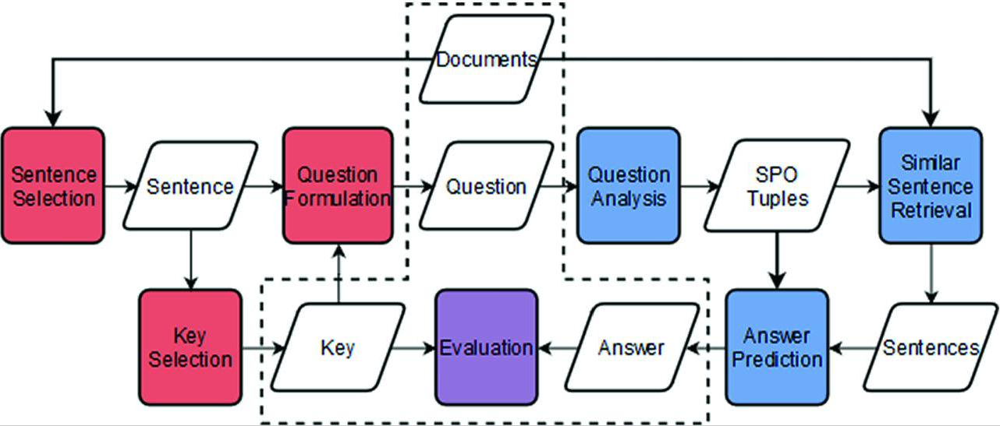

# Literature

## spaCY based

##### [Exploring NLP and Information Extraction to Jointly Address Question Generation and Answering](https://www.ncbi.nlm.nih.gov/pmc/articles/PMC7256591/)

- text > candidate sentences > generate questions with `POS/NER` & answers with `SPO Tuples`
  
  
  
    ```bash
    text
    - Select candidate sentences with questionable facts:
      - tokenize
      - POS & NER
      - Has structure following established rules
      - for each selected sentence:
        - Key Selection: 
          - Select the word(s) that will be the answer to the generated question
        - Question Generation
          - Use transformation rules.
          
    text
    - For each generated question:
      - NER, Dependency Parsing Tree & POS
      - select sentences that may contain the answer, using TF-IDF + cosine similarity
      - for each selected sentence: 
        - Question Answering
          - SPO Tuples (Subject; Predicate; Objects)
            - Lemmatize every predicate
            - discard SPO Tuples as possible answers to the question if:
            - predicate in the triple does not match the one in the question
            - question contains both the subject and the object
          - for remaining SPO Tuples:
              - if the question has only the subject/object, the object/subject is a possible answer
          
          
    
    
    ```
  
- Find **candidate sentences** with one or more **questionable facts**:
  
  - Through **POS** we can know the grammatical class of each of the words.
    - Through **NER** we can find out if a phrase is expressing information about people, places, dates, countries, cities, states, money, or events. 
      - For instance, when a sentence begins with an entity type person followed by a verb, it is likely that the sentence is related to a certain person performing a particular action; we can thus ask who is the person performing that specific action.
  - Sentence has a structure with at least one of the established rules:
  
- Using regular expressions
  
- **Key selection**:
  
    - These are the word(s) that will be the answer to the generated question.
  - These words are the questionable facts and may be referring to people (Who? What people?), locations (Where?, Which country?), dates (When?), amounts (How much?), organizations (Which organization?) and events (Which event?).
  
  - **Question Generation**:
  
    - Transformation rules take into account the position of pronouns,  auxiliary and main verbs as well as phrases that are in active and  passive form.
  
      
  
    - We have considered several particular cases where the sentences needed certain adjustments. These cases are listed as follows:
    
      - The phrase is in the passive form. The system will transform it to active form;
      - The phrase has the main verb and the auxiliary verb. The system will create the question in a way that both verbs stay in the correct positions;
      - The phrase has more than one entity. The system will detect the given entities and, if it finds a relationship between them, it will question accordingly;
      - The main verb is in the past and, for that case, it changes the verb tense.
      
    
    
  
- **Tokenization** is done with [NLTK](www.nltk.org):
  
  - ...
  
- **POS tagging & NER** for QG module is done with [spaCY](https://spacy.io/models/en):
  
    - PER (People, including fictional)
    - DATE (Absolute or relative dates or  periods)
    - GPE (Countries, cities, states) 
    - LOC (Non-GPE locations,  mountain ranges, bodies of water)
    - ORG (Companies, agencies,  institutions)
    - MONEY (Monetary values, including unit)
    - EVENT (Named  hurricanes, battles, wars, sports events)
  - Additionally, spaCy also  identifies context-specific token vectors, POS tags, dependency parse  and named entities
  
- **NER, Dependency Parsing Tree & POS** for QA module is done with Stanford CoreNLP

  - **SPO Tuples** (Subject; Predicate; Objects) for QA module are Extracted with [Open IE](http://knowitall.github.io/openie):

    - *Open IE is an open information extractor that find relationships in sentence*

    - *Can be used for non-commercial purposes only*

    - *[Github for OpenIE-standalone](https://github.com/dair-iitd/OpenIE-standalone)*

    - Ex 1: `Jack and Jill visited India, Japan and South Korea.`

      ```bash
      (Subject, Predicate, Object)
      (Jack   , visited  , India)
      (Jill   , visited  , India)
      (Jack   , visited  , Japan)
      (Jill   , visited  , Japan)
      (Jack   , visited  , South Korea)
      (Jill   , visited  , South Korea)
      ```

    - Ex 2: `The U.S. president Barack Obama gave his speech on Tuesday and Wednesday to thousands of people.`

      ```bash
      (Subject     , Predicate          , Object)
      (Barack Obama, is the president of, United States)
      (Barack Obama, gave               , his speech)
      (Barack Obama, gave his speech    , on Tuesday)
      (Barack Obama, gave his speech    , on Wednesday)
      (Barack Obama, gave his speech    , to thousands of people)
      ```

      

  - **Question Answering**:

    - **Question:** What people reigned jointly as count and countess of Portugal?
    
      **Most relevant sentence:** Henry and Anne reigned jointly as count and countess of Portugal.
    
      - **Triple 1:** ‘subject’: ‘Anne’, ‘predicate’: ‘reigned jointly as’, ‘object’: ‘count of Portugal’,
      - **Triple 2:** ‘subject’: ‘Henry’, ‘predicate’: ‘reigned jointly as’, ‘object’: ‘countess of Portugal’
      - **Predicted Answer:** Anne Henry
      - **Correct Answer:** Henry and Anne

## Deep Learning based

##### [A Framework for Automatic Question Generation from Text using Deep Reinforcement Learning](https://arxiv.org/abs/1808.04961v2)

- Deep Reinforcement Learning approach, using a *`generator-evaluator`* framework
- Shown excellent results on SQuAD benchmark


### [bert-uncased-tf2-qa on tfhub](https://tfhub.dev/see--/bert-uncased-tf2-qa/1)

- 2nd place entry in Kaggle's TensorFlow 2.0 Question Answering challenge[[3](https://www.kaggle.com/c/tensorflow2-question-answering/notebooks)].  
  - [Their Jupyter Notebook](https://www.kaggle.com/seesee/submit-full)

- Maps from a question and text to the answers within the text.

## Other... (to read)

##### [Answering Complex Questions Using Open Information Extraction](https://arxiv.org/abs/1704.05572)


